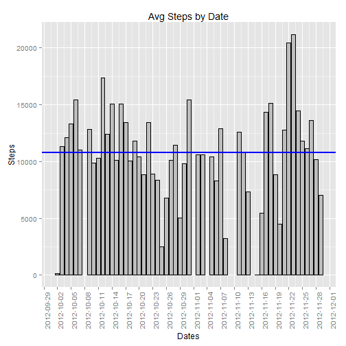
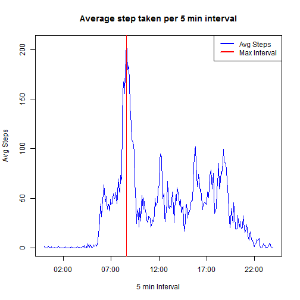
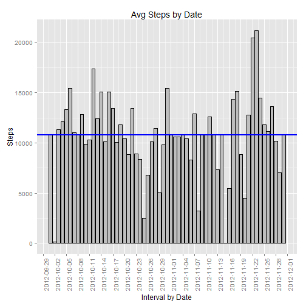
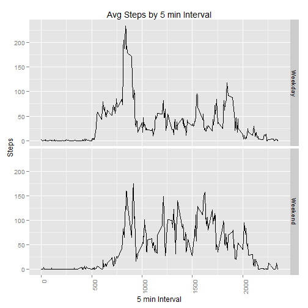

```r
opts_chunk$set(fig.path = "Figures/")
```
---
output: html_document
---
# Reproducible Research: Peer Assessment 1

It is now possible to collect a large amount of data about personal movement using activity monitoring devices such as a Fitbit, Nike Fuelband, or Jawbone Up. These type of devices are part of the "quantified self" movement - a group of enthusiasts who take measurements about themselves regularly to improve their health, to find patterns in their behavior, or because they are tech geeks. But these data remain under-utilized both because the raw data are hard to obtain and there is a lack of statistical methods and software for processing and interpreting the data.

This assignment makes use of data from a personal activity monitoring device. This device collects data at 5 minute intervals through out the day. The data consists of two months of data from an anonymous individual collected during the months of October and November, 2012 and include the number of steps taken in 5 minute intervals each day.

##Data

The data for this assignment can be downloaded from the course web site:

* **Dataset**: [Activity monitoring data](https://github.com/aisley/RepData_PeerAssessment1/blob/master/activity.zip) [52K]

The variables included in this dataset are:

* **steps**: Number of steps taking in a 5-minute interval (missing values are coded as `NA`)

* **date**: The date on which the measurement was taken in YYYY-MM-DD format

* **interval**: Identifier for the 5-minute interval in which measurement was taken

The dataset is stored in a comma-separated-value (CSV) file and there are a total of 17,568 observations in this dataset.

All Files necessary to recreate this research can be found in this [Github repository][1]: 

[1]: https://github.com/aisley/RepData_PeerAssessment1 "Github REpository"

## Loading and preprocessing the data


```r
fileURL <- "https://github.com/aisley/RepData_PeerAssessment1/blob/master/activity.zip"

SourceFile <- "activity.zip"
fileDir <- "Data"

#Check if Data Dir exists adn create if not
if(!file.exists(fileDir)) {
     dir.create(fileDir)
}

#Get the Data dir to place the files
DataFileDir <- paste(getwd(), fileDir, sep="/")

zipFile <- paste(getwd(), SourceFile, sep="/")
if(!file.exists(zipFile)) 
     {
          download.file(fileURL, destfile=SourceFile)
     } 

#Check to see if file was downloaded
if(!file.exists(zipFile)) {
     DataFileDir <- "ERR"
} else {
     unzip(zipFile,  exdir = DataFileDir)
}

dataFile <- paste(getwd(), "data/Activity.csv", sep="/")

activity <- read.csv(dataFile, header=TRUE, sep=",")
```

Lets take a look at a sample of the data that was loaded.


```r
head(activity)
```

```
##   steps       date interval
## 1    NA 2012-10-01        0
## 2    NA 2012-10-01        5
## 3    NA 2012-10-01       10
## 4    NA 2012-10-01       15
## 5    NA 2012-10-01       20
## 6    NA 2012-10-01       25
```
The activity data set consisted of 17568 rows and 3 columns. 

The column names are **steps, date, interval** and their respective class are **integer, factor, integer**.  The date column needs to have it data type corrected from factor to date.


```r
#convert the date to a date format
activity$date <- as.Date(as.character(activity$date), format="%Y-%m-%d")
```
Verify the data types are correct.

The column names are **steps, date, interval** and their respective class is **integer, Date, integer**.

Quickly we notice that NA is used to represent missing or not recorded values.  These will be removed later in our analysis.

Before we beginn our analysis, several libraries are needed.

```r
# Install and load all required libraries used in this analysis
for (x in c("ggplot2", "plyr")) { 
if (x %in% rownames(installed.packages()) == FALSE) { 
    install.packages(x) 
    } 
} 
require(ggplot2) 
```

```
## Loading required package: ggplot2
```

```r
require(plyr) 
```

```
## Loading required package: plyr
```
## What is mean total number of steps taken per day?

In this section we will calculate the total steps per day while ignoring the missing(NA) values.

```r
#Aggregate the total steps by day
activity.TotalStepsPerDay <- aggregate(steps ~ date, data=activity, FUN=sum, na.action = na.omit) 
StepsMean <- mean(activity.TotalStepsPerDay$steps , na.rm=TRUE) 
StepsMedian <- median(activity.TotalStepsPerDay$steps , na.rm=TRUE) 

p <- ggplot(activity.TotalStepsPerDay, aes(x=date, y=steps)) 
p <- p + geom_histogram(stat="identity", binwidth=1000, color="black", fill="grey") 
p <- p + xlab("Dates") 
p <- p + ylab("Steps") 
p <- p + ggtitle("Avg Steps by Date") 
p <- p + theme(axis.text.x = element_text(angle = 90, hjust = 1)) 
# add a mean line to the hist
p <- p + geom_hline(aes(yintercept=StepsMean),   
               color="blue", linetype="solid", size=1)
p <- p + scale_x_date(breaks = "3 days")
p 
```

 

Mean Steps: **10766** 

Median Steps: **10765**

## What is the average daily activity pattern?
Lets determine the mean by 5 min interval.

```r
#get the average my 5 min interval
activity.AvgStepsByInterval <- aggregate(steps ~ interval, data=activity, FUN=mean, na.action = na.omit) 
#Save the Data before converting the interval.  this step is necessary for the next phase of analysis
activity.AvgStepsByIntervalSave <- activity.AvgStepsByInterval
#convert the interval to a time
activity.AvgStepsByInterval$interval <- sprintf("%04d", activity.AvgStepsByInterval$interval)
activity.AvgStepsByInterval$interval <- strptime(paste0(substr(activity.AvgStepsByInterval$interval, 1, 2), ":", substr(activity.AvgStepsByInterval$interval, 3, 4)), "%H:%M")

MaxAvg <- max(activity.AvgStepsByInterval$steps)
MaxInterval <- activity.AvgStepsByInterval[which.max(activity.AvgStepsByInterval$steps), 1]
#convert the MaxInterval into a Time format
#MaxInterval <- sprintf("%04d", MaxInterval)
#MaxInterval <- strptime(paste0(substr(MaxInterval, 1, 2), ":", substr(MaxInterval, 3, 4)), "%H:%M")


plot(x=activity.AvgStepsByInterval$interval
     ,y=activity.AvgStepsByInterval$steps
     ,type="l"
     ,col="blue"
     ,xlab="5 min Interval"
     ,ylab="Avg Steps"
     ,main = "Average step taken per 5 min interval"
)

abline(v=as.POSIXct(MaxInterval), col = "red")
legend(x="topright", c("Avg Steps", "Max Interval"), lty=c(1,1), lwd=c(2.5,2.5),col=c("blue","red"))
```

 

The maximun number of steps on avg: **206.2** occured during the Interval: **08:35** 

## Imputing missing values

For the next set of analysis, we will replace any missing(NA) intervals and replace them with the mean step for the given interval as calculated in the previous section.

Out of **17568** total records, **2304** are missing values.  We will replace these with teh mean of the given interval.


```r
#determine the number missing values
activity.merge<- merge(activity, activity.AvgStepsByIntervalSave, by = "interval", suffixes = c("", ".y"))
#identify the missing and nonmissing values
nas <- is.na(activity.merge$steps)

activity.merge$steps[nas] <- activity.merge$steps.y[nas]
activity.complete <- activity.merge[ , c(1:3)]

#Aggregate the total steps by day
activity.TotalStepsPerDayNew <- aggregate(steps ~ date, data=activity.complete, FUN=sum) 
StepsMean2 <- mean(activity.TotalStepsPerDayNew$steps , na.rm=TRUE) 
StepsMedian2 <- median(activity.TotalStepsPerDayNew$steps , na.rm=TRUE) 

#plot the results in a histogram
p <- ggplot(activity.TotalStepsPerDayNew, aes(x=date, y=steps)) 
p <- p + geom_histogram(stat="identity",binwidth=1000, color="black", fill="grey") 
p <- p + xlab("Interval by Date") 
p <- p + ylab("Steps") 
p <- p + ggtitle("Avg Steps by Date") 
p <- p + theme(axis.text.x = element_text(angle = 90, hjust = 1)) 
# add a mean line to the hist
p <- p + geom_hline(aes(yintercept=StepsMean2),   
               color="blue", linetype="solid", size=1)
p <- p + scale_x_date(breaks = "3 days")
p 
```

 

Did replaceing the missing values with the mean cause the mean/median to change?

Origial Mean Steps(ignore NA): **10766** 

New Mean Steps (NA replaced): **10766** 


Original Median Steps(ignore NA): **10765**

New Median Steps (NA replaced): **10766**

The impact of Substituting teh Avg steps Per day into the missing values resulted in: **No Impact**


## Are there differences in activity patterns between weekdays and weekends?
For the next phase of our analysis, we will add a column to the data set indicating it the data falls on a Weekday or the Weekend.

```r
#Add the Column to indicate where the date falls
activity.DayType <- activity
activity.DayType$dayType <- ifelse(weekdays(activity$date) %in% c("Saturday", "Sunday"), 'Weekend', 'Weekday')


groupColumns = c("dayType", "interval")
dataColumns = c("steps")
#Aggregate the data
activity.AvgStepsByIntervalDayType <- ddply(activity.DayType, groupColumns, summarize, avgSteps = mean(steps, na.rm=TRUE))

#Plot the data
p <- ggplot(activity.AvgStepsByIntervalDayType, aes(x=interval, y=avgSteps)) 
p <- p + facet_grid(dayType ~ .) 
p <- p + geom_line()
#p <- p + geom_histogram(stat="identity",binwidth=1000, color="black", fill="grey") 
p <- p + xlab("5 min Interval") 
p <- p + ylab("Steps") 
p <- p + ggtitle("Avg Steps by 5 min Interval") 
p <- p + theme(axis.text.x = element_text(angle = 90, hjust = 1)) 
p 
```

 


